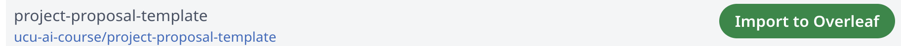

<p align="center">
  
</p>

<h1 align="center">Physics Lab Report Templates</h1>
<p align="center"><em>ДВВ "Fundamentals of Applied Physics" (1.26-27) — Ukrainian Catholic University</em></p>

<p align="center">
  <a href="LICENSE"></a>
</p>

A LaTeX template for writing lab reports for this elective course, with a
ready-made report skeleton for each lab.

## Labs in this repo

```
labs/
├── 01-pendulums/    Математичний і фізичний (оборотний) маятники
├── 02-oberbeck/     Маятник Обербека
├── 03-maxwell/      Маятник Максвелла
├── 04-atwood/       Машина Атвуда
└── _template/       Blank starting point for a lab not listed above
```

Each `labs/<lab>/` folder is **self-contained**: it has its own `main.tex`,
`ucaphyslab.cls`, `assets/`, `.latexmkrc`, and `references.bib`, so you can
open, zip, or Overleaf-import a single lab folder on its own. `main.tex` in
each one already has the lab's title/subtitle filled in and is otherwise the
same blank report skeleton — see [What's already filled in](#whats-already-filled-in).

Don't have a lab from this list? Copy `labs/_template/` to a new folder
(e.g. `labs/05-your-lab/`) and start from there.

## Three ways to use a lab template

Options 1 and 2 both run in Overleaf (no local install needed); option 3
compiles on your own machine. All three work per-lab — pick the
`labs/<lab>/` folder you need.

### Option 1: Overleaf via GitHub sync

Best if you already keep your work on GitHub — keeps Overleaf and your repo
in sync in both directions as you edit.

1. Get your own copy of this repository on GitHub (fork it, or use
   GitHub's "Use this template" button) — see
   [Working with a lab partner](#working-with-a-lab-partner) if you're
   sharing it with a teammate.
2. In Overleaf, go to **New Project → GitHub repo**. The first time you
   do this, Overleaf will ask you to connect/authorize your GitHub
   account:

   

   If you get stuck authorizing the connection, see
   [Overleaf's GitHub sync docs](https://docs.overleaf.com/integrations-and-add-ons/git-integration-and-github-synchronization/github-synchronization)
   and
   [GitHub's OAuth app docs](https://docs.github.com/en/apps/oauth-apps/using-oauth-apps/installing-an-oauth-app-in-your-personal-account#installing-an-oauth-app-in-your-personal-account).
3. Pick your repository from the list and click **Import to Overleaf**:

   

   Overleaf imports the *whole* repo as one project, so it'll try to
   compile whatever `.tex` file it finds first. Open the project's
   **Menu → Main document** and pick the lab you're working on, e.g.
   `labs/04-atwood/main.tex`.
4. Edit, recompile, and use Overleaf's GitHub sync panel to push your
   commits back when you're done.

### Option 2: Overleaf via zip upload

Package a single lab folder into a zip and upload it directly. There's no
sync with this option: re-run the same command and re-upload whenever you
want to update the Overleaf copy.

**macOS / Linux:**
```bash
cd labs/04-atwood   # swap in whichever lab you're working on
zip -r ../../lab-report.zip .
```

**Windows (PowerShell):**
```powershell
cd labs\04-atwood
Compress-Archive -Path * -DestinationPath ..\..\lab-report.zip
```

Then in Overleaf: **New Project → Existing project (.zip)**, and upload
`lab-report.zip`.

### Option 3: Compile locally

Install a XeLaTeX-capable TeX distribution, then use `latexmk` (already
configured for XeLaTeX + BibTeX via `.latexmkrc`, no extra flags needed).

**macOS:**
```bash
brew install --cask mactex   # full distribution (~5 GB) -- simplest option
```
Lighter alternative: `brew install --cask basictex`, then install
whatever `latexmk` complains is missing with `tlmgr install <package>`.

**Windows:**
Install [MiKTeX](https://miktex.org/download) and leave "Install missing
packages on the fly" enabled (on by default) — it fetches what it needs
the first time you compile. [TeX Live](https://tug.org/texlive/windows.html)
is a full-up-front alternative if you'd rather not install packages
on demand.

**Linux (Debian/Ubuntu):**
```bash
sudo apt install texlive-xetex texlive-latex-extra texlive-fonts-extra \
  texlive-lang-cyrillic texlive-bibtex-extra latexmk
```

Commands to know, once installed (run from inside the lab folder you're
working on, e.g. `cd labs/04-atwood`):
```bash
latexmk main.tex   # compile (XeLaTeX + BibTeX)
latexmk -c         # remove build artifacts, keep the PDF
latexmk -C         # remove build artifacts AND the PDF -- do a full clean
                    # rebuild with this if something looks stale/broken,
                    # e.g. after pulling changes to ucaphyslab.cls
```

If Charis SIL or Fira Sans aren't installed, the class automatically
falls back to DejaVu and warns about it in the compilation log (see
[Fonts](#fonts) below) — you don't need to hunt down the exact font
packages yourself.

## What's already filled in

Each `labs/<lab>/main.tex` has the lab's **title and subtitle** set. Everything
else — student name(s), teacher, date, and every section's content (goal,
equipment, theory, measurements, error analysis, conclusions) — is still the
same blank placeholder text you need to fill in yourself, same as in
`labs/_template/`.

## What you can and cannot change

**Don't change**: fonts, page margins, font sizes, colors, the structure
and order of the title page elements, or any `ucaphyslab.cls` file.

**Don't delete sections** of the main text, even if one seems irrelevant
to a particular lab — in that case, write one sentence explaining why it
doesn't apply.

**Do edit**: only the text and metadata in `labs/<lab>/main.tex` (title,
subtitle, student(s), teacher, date, section content) and the matching
`references.bib`.

### Shared files and keeping them in sync

`ucaphyslab.cls`, `.latexmkrc`, and `assets/` are duplicated into every
`labs/<lab>/` folder on purpose, so each lab compiles on its own (no
symlinks — those don't always survive Windows checkouts or Overleaf zip
imports). The copies at the **root** of this repo are the source of truth.

If you ever need to change one of these shared files (e.g. a class-file
fix from an instructor update), edit the root copy, then run:

```bash
./scripts/sync-shared.sh
```

to propagate it to every `labs/*/` folder. CI
(`.github/workflows/build.yml`) fails the build if a lab's copy drifts out
of sync with root, so you won't miss it in a PR review.

## Working with a lab partner

This course allows group work, and `\student{}` in `main.tex` already
supports a second co-author line (just uncomment it). To actually share
the work:

1. One of you creates the GitHub repo (fork this one, or use "Use this
   template"), and adds the other as a **collaborator** (repo → Settings
   → Collaborators).
2. Both clone it locally: `git clone <repo-url>`.
3. Before you start editing, `git pull` to get your partner's latest
   changes — LaTeX source is plain text, so simultaneous edits to
   *different* sections of the same `main.tex` merge fine; edits to the
   *same* lines will conflict and need manual resolution.
4. Commit and push often in small chunks (e.g. one section at a time)
   rather than one huge commit at the end — it makes conflicts easier to
   resolve and gives you a real history if you need to revert something.
5. If you prefer not to risk stepping on each other's edits directly on
   `main`, work in a branch per person and open a pull request to merge —
   optional for a two-person report, but useful if you want a review step.

## Changing the language

The document language is a class option on the first line of `main.tex`:

```latex
\documentclass[ukrainian]{ucaphyslab}   % default
\documentclass[english]{ucaphyslab}
```

This switches the language of everything the class controls: the title
page labels ("Виконав(ла)" / "Performed by", "Перевірив(ла)" / "Reviewed
by", etc.), the "submitted for..." line, the running header/footer,
hyphenation (via `polyglossia`), and the PDF's `pdflang` metadata.

It does **not** translate your own content — the section text in
`main.tex` and the entries in `references.bib` stay whatever language you
typed them in. Pick the class option that matches the language you're
writing in, so the labels and your text agree.

Options can be combined with a comma, e.g. `[english,slogan]`.

Note: the UCU seal and Faculty of Applied Sciences logo on the title page
currently only exist as English-language image files, so they'll show
English text even in `[ukrainian]` mode until Ukrainian-language versions
are added to each lab's `assets/logo/` (and synced via `scripts/sync-shared.sh`).

## Fonts

Body text — **Charis SIL**, headings and title page — **Fira Sans**.
Both are included in standard TeX Live (packages `charissil` and `fira`)
and available in Overleaf with no extra setup. If a typeface isn't
installed, the class **explicitly warns about it in the compilation log**
and falls back to a substitute font (`DejaVu Serif` / `DejaVu Sans`) —
there's no silent substitution.

## Tip

Check that a lab compiles without errors or warnings well before the
deadline — this leaves time to fix things if something goes wrong (e.g.
you forgot one of the required title page elements). Every push and PR
also gets auto-built by CI (`.github/workflows/build.yml`), so you can
check the Actions tab / PR checks instead of compiling locally if you'd
rather not install a TeX distribution.

## Contributing

Stars and forks are welcome. Found a bug in a template? PRs are welcome
too.

## License

MIT — see [LICENSE](LICENSE).
